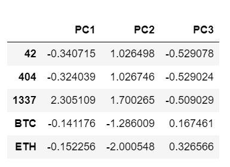
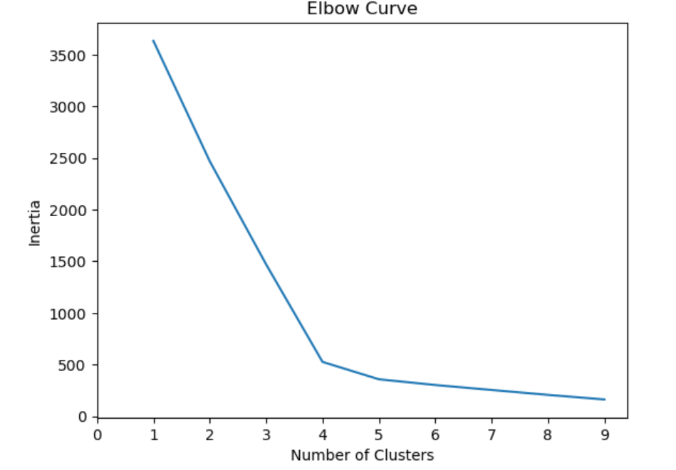
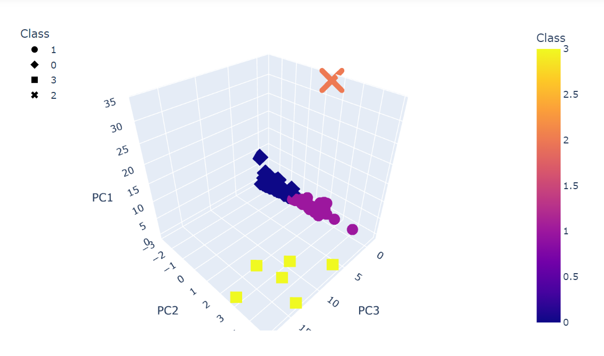
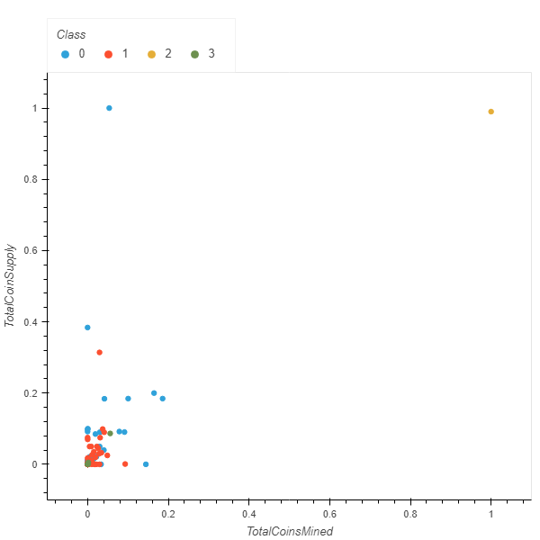

# Cryptocurrencies
## Overview
Accountability Accounting is a prominent investment back interested in offering a new cryptocurrency investment portfolio for its customers. The senior manager for the Advisory Services Team has asked for a report to be created that includes what cryptocurrencies are on the trading market and how they could be grouped to create a classification system for this new investment.

## Purpose
Our purpose is to process the data to fit the machine learning models. We will be using unsupervised learning and to group the cryptocurrencies, we have decided on a clustering algorithm. To visualize the data, a scatter plot will be used to share the findings with the board.

## Results
To preprocess the data, we cleaned the data by using only cryptocurrencies currently being traded. Then, we turned all our text features into binary values and then our data was scaled. Using the Principal Component Analysis (PCA) algorithm, we reduced the dimensions of the data to three principal components. 

Using the K-means algorithm, an elbow curve was created to find the best value for K to predict the clusters for the cryptocurrencies’ data.

A 3-D scatter plot was created to visualize the distinct groups that correspond to the three principal components.

A scatter plot was created to show the number of tradable cryptocurrencies. Where the X-axis is Total Coins Mined and the Y-axis is Total Coin Supply.

